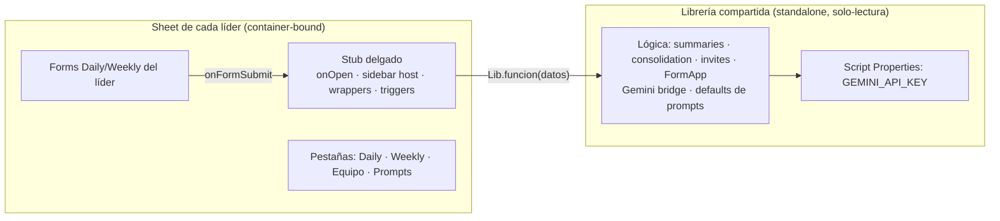

# Architecture and Contracts

Este documento es el mapa de escritura de código de CoS-Agent. Léelo antes de cambiar código
de runtime, helpers compartidos o specs de workflow.

## Intent arquitectónico

CoS-Agent es un MVP hecho de automatizaciones **container-bound** de Apps Script, deliberadamente
pequeñas: un Sheet de settings, archivos de Apps Script, Forms y una carpeta de Drive. El código
común vive en **una librería compartida** — no se copia en cada Sheet.

La arquitectura favorece **conVtratos explícitos sobre abstracción**. Si un comportamiento debe
reusarse, se define el contrato en `shared/` (dentro de la librería), se documenta en `Docs/` y
se cubre con un test. Si es específico de un workflow, se queda ahí hasta que un segundo workflow
necesite el mismo contrato.

### Dos artefactos, un contrato

El stub **no contiene lógica de negocio**: reenvía a la librería. La librería **no toca la UI ni
los triggers** del contenedor: recibe datos y devuelve resultados.

---

## Capas

| Capa | Archivos / superficie | Posee | No debe poseer |
|---|---|---|---|
| **Dev tooling** | `package.json`, `scripts/`, `cos.config.json` | Sync local, comandos clasp, IDs del entorno | Comportamiento de runtime |
| **Librería (runtime compartido)** | `shared/*.js` | Helpers cross-workflow, Gemini bridge, defaults de prompts, contratos reusables | Reglas de negocio de un solo workflow · triggers · UI |
| **Config del workflow** | `workflows/<NAME>/config.js` | IDs, nombres de pestaña, patrones de nombres | Lógica |
| **Código del workflow (stub)** | `workflows/<NAME>/*.js` | Orquestación de menú, triggers y secuencia específica; wrappers de `google.script.run` | Helpers genéricos (van a `shared/`) |
| **Runtime settings** | Pestañas del Sheet (`Daily`, `Weekly`, `Equipo`, `Prompts`) | Datos y config editados por el líder | IDs hardcodeados o lógica |
| **Artefactos de Drive** | Forms, correos generados | Superficies humanas y salidas | Fuente de verdad de contratos de código |
| **Documentación** | `Docs/` | Contratos legibles por humano/IA y specs de workflow | Comportamiento no implementado como si existiera |
| **Tests locales** | `tests/**/*.test.mjs` | Chequeos de contrato con mocks de GAS | Prueba de integración en vivo con Drive/Sheets |

---

## Desviación consciente de AOS: usamos una librería

El proyecto de referencia **AOS** establece en su `conventions.md`: *"una script container-bound
por workflow; tasks expuestas como items de menú en `onOpen()`. Sin librerías standalone (todavía)."*

**CoS-Agent se desvía de esa regla a propósito** y **sí usa una librería runtime standalone.**

**Por qué:**

- El objetivo de negocio es **distribuir a cada líder sin repartir el código** y **ocultar la
  API key**. El modelo clasp-dev-sync de AOS copia el código en cada proyecto bound (queda
  visible) y requiere clasp por líder — incompatible con "amigable y sin código a la vista".
- Una librería solo-lectura con el key en Script Properties es el mínimo que oculta código y key,
  y permite actualizar a todos los líderes desde un solo lugar.

**Costo aceptado:** una librería corre algo más lento que un proyecto monolítico y no permite
breakpoints dentro de ella desde el stub (se depura abriendo la librería o con `console.log()`).
Ver el detalle en [conventions.md](conventions.md#patrón-librería--stub) y
[engineering-playbook.md](engineering-playbook.md).

> Si en el futuro se migra a **Add-on**, esta desviación se revisa: el Add-on oculta el código de
> forma nativa y podría reabsorber el rol de la librería.

---

## Anclas de implementación

Este es el mapa canónico de archivo/test. Otros docs enlazan aquí en vez de repetir listas de
archivos. Se agrega un ancla nueva solo cuando un archivo se vuelve una superficie de contrato estable.

| Superficie | Archivo canónico | Estado |
|---|---|---|
| Config del workflow (estático) | `workflows/CLEVEL-REPORTS/config.js` | Implemented |
| Bootloader del stub (delegación + puente `cosRun` + triggers) | `workflows/CLEVEL-REPORTS/stub.js` | Implemented |
| UI de la librería (menú, sidebar, diálogos, `dispatch`) | `shared/ui-runtime.js` | Implemented |
| HTML del sidebar (5 paneles: Prompts · Horarios · Equipo · Reuniones · Brain) | `shared/Sidebar.html` | Implemented |
| HTML del modal de preguntas y formularios | `shared/DialogPreguntas.html` | Implemented |
| Instalación de triggers | `workflows/CLEVEL-REPORTS/triggers.js` | Implemented |
| Bridge único con Gemini (incl. `responseSchema`) | `shared/gemini-runtime.js` | Implemented |
| Generación de preguntas por IA (schema + saneado/degradado/cap) | `shared/forms-ai-runtime.js` | Implemented |
| Composición de prompts (soul+user+task) | `shared/prompts-runtime.js` | Implemented |
| Resumen por fila | `shared/summaries-runtime.js` | Implemented |
| Consolidados al líder | `shared/consolidation-runtime.js` | Implemented |
| Plantillas HTML de correo | `shared/email-runtime.js` | Implemented |
| Invitaciones (envío) | `shared/invites-runtime.js` | Implemented |
| Dispatcher (timing) + guardas anti-dup + scan de silencios + purga de raw + pasada de Deep Prep + lote de backfill + reportes compartidos al cierre | `shared/dispatcher-runtime.js` | Implemented |
| Generación de Forms (FormApp: título/descr./obligatoriedad/ayuda) | `shared/forms-runtime.js` | Implemented |
| Acceso a Sheets/columnas/horas | `shared/sheets-runtime.js` | Implemented |
| Lectura de `Equipo` (roster) | `shared/roster-runtime.js` | Implemented |
| Ajustes editables + `formMeta` + `guardarFormulario` + flags del brain | `shared/settings-runtime.js` | Implemented |
| Second brain — carpeta/IO en Drive (markdown + frontmatter, slugs, borrado, índice regenerable) | `shared/brain-drive-runtime.js` | Implemented |
| Second brain — ingesta por fila (regenera páginas persona/proyecto, log; compuerta de sanidad de nombres + catálogo de proyectos como enum por llamada) | `shared/brain-ingest-runtime.js` | Implemented |
| Second brain — admin/gobernanza (visor wiki, merge, flags, olvidar persona/proyecto, purga, diagnóstico y reparación del wiki para copias que vienen de versiones viejas) | `shared/brain-admin-runtime.js` | Implemented |
| Second brain — backfill del histórico (job por cursor en el dispatcher) | `shared/brain-backfill-runtime.js` | Implemented |
| Deep Prep — briefing pre-reunión (Calendar + brain → Gemini → PDF por correo) | `shared/deepprep-runtime.js` | Implemented |
| Compartir reportes — individual por persona + cc del consolidado (modal matriz) | `shared/sharing-runtime.js` | Implemented |
| Notas de Gemini (Meet) → brain (descubrimiento 3 fuentes, match por evento, externos) | `shared/meet-notes-runtime.js` | Implemented |
| Hoja Tareas del líder (dropdowns con chips de color, Vence con date-picker, archivado a Archivo, espejo en wiki/tasks) | `shared/tasks-runtime.js` | Implemented |
| Morning Briefing (agenda + pendientes + urgente + foco; hora/días/secciones configurables) | `shared/briefing-runtime.js` | Implemented |
| HTML del modal Morning Briefing (config + vista previa en vivo) | `shared/DialogBriefing.html` | Implemented |
| Seguimiento del equipo — control determinista: cola Hoy, compromisos, flujo 30d, tendencias Daily y cierre de pendientes; Personas/Actividad se conservan en Más | `shared/seguimiento-runtime.js` | Implemented |
| HTML del modal Seguimiento — tabs Hoy/Compromisos/Flujo/Tendencias, Más, drawer responsive y fallback CSS | `shared/DialogSeguimiento.html` | Implemented |
| Mi seguimiento — tareas del líder (Hoy/Tareas/Tablero/Tendencia, mutadores por Id, creación híbrida, foco manual, Nivel 0 desde wiki/tasks, índice `_tasks.json`, columnas Espera de/Link/EventId con migración idempotente) | `shared/miseguimiento-runtime.js` (+ índice y migración en `shared/tasks-runtime.js`) | Implemented (R1-R3; diseño en `Docs/workflows/MI-SEGUIMIENTO.md`) |
| HTML del modal Mi seguimiento (4 tabs + panel ➕ Nueva + popover posponer + charts SVG cliente) | `shared/DialogMiSeguimiento.html` | Implemented |
| Web App de follow-up (tokens un-solo-uso, GET nunca muta, 4 acciones + deshacer, higiene) | `shared/webapp-runtime.js` | Implemented |
| HTML del modal Compartir reportes | `shared/DialogCompartir.html` | Implemented |
| Mock harness de GAS para tests | `tests/gas-harness.mjs` | Implemented |
| Tests de contrato compartido | `tests/shared.test.mjs` | Implemented (39 tests) |
| Tests del workflow (settings/forms/consolidado) | `tests/clevel-reports.test.mjs` | Implemented (33 tests) |
| Tests de generación de preguntas por IA | `tests/forms-ai-runtime.test.mjs` | Implemented (13 tests) |
| Tests de UI (menú, diálogos, `dispatch`) | `tests/ui-runtime.test.mjs` | Implemented (9 tests) |
| Tests del second brain — IO en Drive | `tests/brain-drive-runtime.test.mjs` | Implemented (16 tests) |
| Tests del second brain — ingesta por fila (incluye compuerta + enum + dedup) | `tests/brain-ingest-runtime.test.mjs` | Implemented (20 tests) |
| Tests del second brain — scan de silencios (dispatcher) | `tests/brain-silences-runtime.test.mjs` | Implemented (6 tests) |
| Tests del second brain — admin/gobernanza (incluye reparación del wiki) | `tests/brain-admin-runtime.test.mjs` | Implemented (17 tests) |
| Tests del second brain — backfill del histórico | `tests/brain-backfill-runtime.test.mjs` | Implemented (19 tests) |
| Tests de compartir reportes | `tests/sharing-runtime.test.mjs` | Implemented (15 tests) |
| Tests de notas de Meet | `tests/meet-notes-runtime.test.mjs` | Implemented (17 tests) |
| Tests del Morning Briefing + hoja Tareas | `tests/briefing-runtime.test.mjs` | Implemented (19 tests) |
| Tests del Seguimiento del equipo (incluye cache) | `tests/seguimiento-runtime.test.mjs` | Implemented (16 tests) |
| Tests de Mi seguimiento (carga, Nivel 0, mutadores, foco, higiene, migración R3, índice R2, fecha real de creación, cache, ruteo) | `tests/miseguimiento-runtime.test.mjs` | Implemented (19 tests) |
| Tests de la Web App de follow-up | `tests/webapp-runtime.test.mjs` | Implemented (14 tests) |
| Tests de Deep Prep | `tests/deepprep-runtime.test.mjs` | Implemented (12 tests) |

> Estrategia de tests y flujo de deploy/versionamiento: [testing-and-deploy.md](testing-and-deploy.md).

---

## Modelo de archivos de runtime

Los archivos de runtime de Apps Script **no usan módulos ES**. Todos los `.js` de runtime
comparten un único namespace global, así que:

- **No** uses `import` / `export` en archivos bajo `shared/` o `workflows/<NAME>/`.
- Usa `.mjs` solo para tooling local y tests (que sí corren en Node).
- Los métodos privados de la librería terminan en guion bajo (`miHelper_`) para que **no sean
  visibles** a quien la incluye.
- El split en varios archivos es puramente organizacional; mantén cada archivo enfocado en una
  responsabilidad.

---

## Contract-Based Development

1. Un contrato se **define** en `shared/`, se **documenta** en `Docs/` y se **prueba** en `tests/`.
2. Un valor que cruza workflows (p. ej. la forma del objeto `roster`, o la clave de
   `GEMINI_API_KEY`) es un **contrato compartido**: cambiarlo obliga a actualizar doc + test.
3. La **detección de estado** (qué ya se envió hoy, qué fila ya tiene `Summary`) no depende de
   nombres legibles sino de guardas explícitas (Script Properties, columna `Summary` no vacía).
4. Los **encabezados de las preguntas NO son un contrato** — el líder los personaliza. El resumen
   usa *pass-through genérico* sobre pares pregunta→respuesta. Ver
   [CLEVEL-REPORTS.md](workflows/CLEVEL-REPORTS/CLEVEL-REPORTS.md#contrato-de-datos) y
   [sidebar-and-prompts.md](workflows/CLEVEL-REPORTS/sidebar-and-prompts.md).
5. **Puente `cosRun` para funciones de servidor nuevas.** El stub solo expone a `google.script.run`
   un conjunto fijo de wrappers nombrados + el puente genérico `cosRun(fnName, argsJson)`. Toda
   función de servidor **nueva** (p. ej. `generarPreguntasIA`, `guardarFormulario`) se registra en
   `DISPATCH_` (`shared/ui-runtime.js`, convención `fn(sheetId, config, ...args)`) y el cliente la
   invoca vía `cosRun` — **nunca** como método directo de `google.script.run` (daría *"Cannot read
   properties of undefined (reading 'apply')"*). Así se agregan funciones sin re-empujar el stub.
