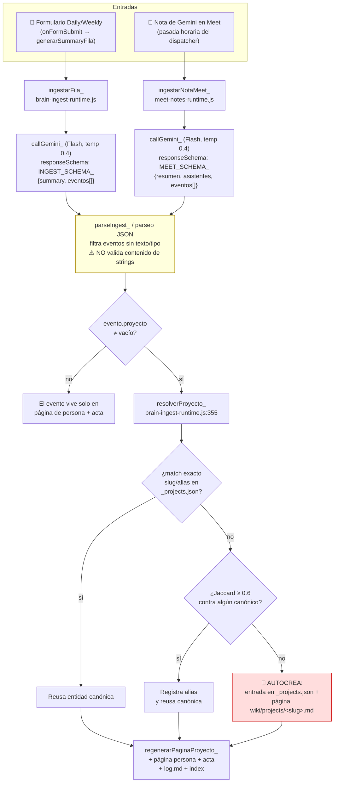
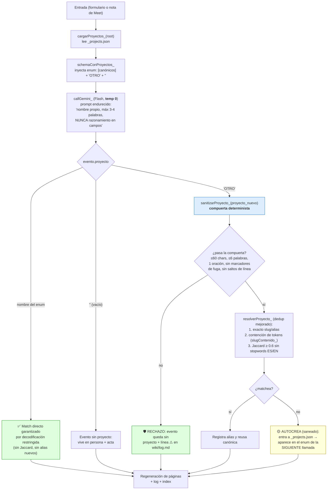
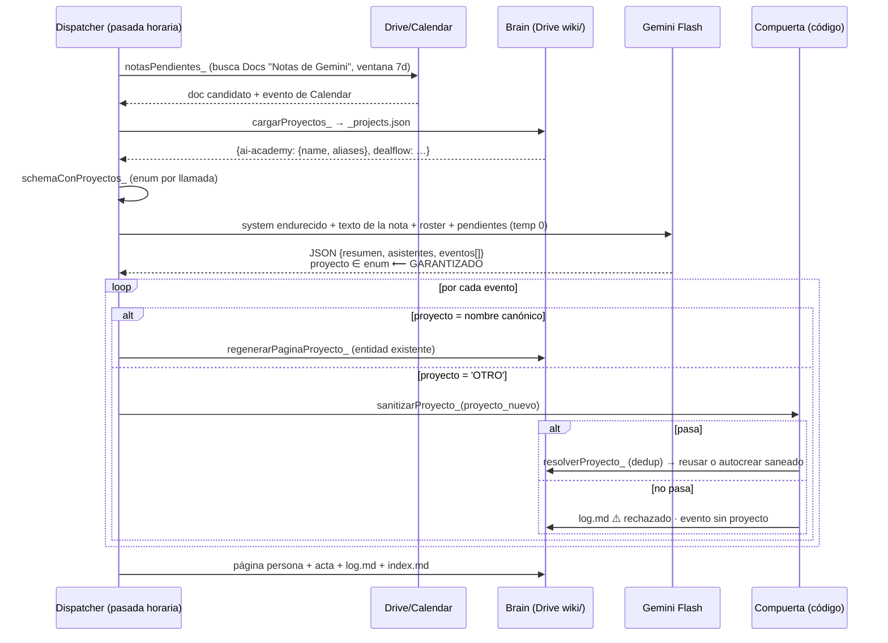
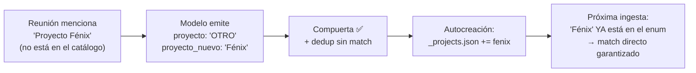

# Proyectos como `enum` — cómo funciona y flujo de datos de la ingesta

> **Estado: IMPLEMENTADO (2026-08-14)** — compuerta, enum por llamada, temperatura 0, dedup con
> contención/stopwords, truncados y `olvidarProyecto` están en código con su matriz de tests
> (ver `tests/brain-ingest-runtime.test.mjs`, `tests/meet-notes-runtime.test.mjs`,
> `tests/brain-admin-runtime.test.mjs`). La fase 2 (cola de aprobación HITL) sigue en backlog.
>
> Documento de diseño del fix a los bugs de títulos de proyecto:
> fuga de razonamiento del LLM dentro del campo `proyecto` y duplicación de páginas en
> `wiki/projects/`. Acompaña al grill de 2026-08-14. Estado actual del código:
> `shared/brain-ingest-runtime.js` (formularios) y `shared/meet-notes-runtime.js` (notas de Meet).

---

## 1. El flujo de datos HOY (dónde nace el bug)

Hay **dos caminos de entrada** al brain y ambos convergen en `resolverProyecto_`:



**Los dos defectos, señalados en el diagrama:**

1. **Nodo amarillo (`parseIngest_`)**: el `responseSchema` de Gemini garantiza la *forma* del
   JSON (decodificación restringida: llaves, tipos, enums), pero **no el contenido de un
   string**. Cuando Flash dudó entre nombres de proyecto, su deliberación entera ("Usaremos
   'AI Academy'. No, dejemos…") entró como valor de `proyecto` y el parseo la aceptó.
2. **Nodo rojo (autocreación)**: cualquier string que no matchee crea entidad. Un nombre de
   300 tokens jamás alcanza Jaccard 0.6 contra `ai-academy` → página basura. Y variantes
   legítimas ("Academia IA" vs "AI Academy") tampoco matchean → **duplicados**.

---

## 2. Qué es el `enum` y por qué es garantía dura

Hallazgo del research (docs oficiales del API de Gemini, ago 2026):

| Restricción en `responseSchema` | ¿Se fuerza? | Mecanismo |
|---|---|---|
| Estructura, tipos, campos `required` | ✅ Sí | Decodificación restringida (el modelo no puede emitir tokens inválidos) |
| `enum` en strings | ✅ Sí | Ídem — literalmente no puede emitir un valor fuera de la lista |
| `maxLength` / `minLength` / `pattern` | ❌ No | El API lo acepta pero es una *pista*; la doc dice "always validate values in your application" |

Conclusión: **`enum` sí es una garantía absoluta; `maxLength` no existe en la práctica.**
Por eso la longitud la garantiza código nuestro (la compuerta `sanitizarProyecto_`), y la
*asignación* a proyectos existentes la garantiza el `enum`.

### El schema se construye POR LLAMADA

Hoy `MEET_SCHEMA_` / `INGEST_SCHEMA_` son constantes. Con el cambio, el campo `proyecto`
se genera dinámicamente leyendo `_projects.json` del wiki del líder justo antes del call:

```js
// pseudocódigo del builder
function schemaConProyectos_(root, baseSchema) {
  var conocidos = Object.keys(cargarProyectos_(root))
                        .map(function (s) { return mapa[s].name; });   // nombres canónicos
  var ev = baseSchema…eventos.items.properties;
  ev.proyecto        = { type: 'string', enum: conocidos.concat(['OTRO', '']) };
  ev.proyecto_nuevo  = { type: 'string' };   // SOLO se lee si proyecto === 'OTRO'
  return baseSchema;
}
```

El modelo ve tres salidas posibles para `proyecto`:

- **Un nombre canónico de la lista** → mapeo directo, sin fuzzy matching, sin error posible.
- **`''` (vacío)** → el hecho no refiere a ningún proyecto distinguible.
- **`'OTRO'`** → el modelo cree que es un proyecto que no está en el catálogo, y propone el
  nombre en `proyecto_nuevo` (campo libre → pasa por la compuerta determinista).

---

## 3. El flujo PROPUESTO (enum + compuerta)



### Secuencia completa de una nota de Meet (propuesta)



---

## 4. ¿Se autoactualiza el catálogo sin HITL? — SÍ (fase 1), con red de seguridad

**Respuesta corta: sí, el enum se retroalimenta solo, sin humano en el loop, en la fase 1.**
El ciclo de vida de un proyecto nuevo:



- **Sin HITL**: nadie aprueba la creación. El humano solo interviene *a posteriori* y en
  excepción: el modal de gobernanza permite `mergearProyectos` (fusionar duplicados) y —nuevo
  en este release— `olvidarProyecto` (borrar una entidad equivocada). El `log.md` deja rastro
  de cada autocreación y cada rechazo, así que la deriva es auditable.
- **La red de seguridad es la compuerta**: la autocreación sigue existiendo, pero ya solo
  puede crear nombres cortos, de una oración, sin marcadores de fuga. El pantallazo del bug
  es **irreproducible por construcción**: un monólogo de 1.900 caracteres no pasa `≤60 chars`.
- **Convergencia del catálogo**: cada proyecto legítimo pasa por "OTRO" exactamente una vez
  (su primera mención); después vive en el enum y el modelo ya no puede inventar variantes
  ("Academia IA" no existe como opción si el enum ofrece "AI Academy" — la decodificación
  restringida lo obliga a elegir del catálogo o declarar OTRO, y el dedup por contención
  atrapa la variante en ese único paso).

**Fase 2 (backlog, con maqueta/grill propio): HITL opcional.** La autocreación se sustituye
por una **cola de "proyectos por confirmar"**: `proyecto_nuevo` válido no crea página sino una
entrada pendiente que el líder aprueba/fusiona/descarta desde el modal de gobernanza. Ahí el
catálogo pasa a ser 100 % curado por humano y el enum se vuelve un vocabulario cerrado real.

### Casos borde del enum, explícitos

| Caso | Comportamiento |
|---|---|
| Wiki nuevo (catálogo vacío) | El enum es solo `['OTRO', '']` → todo proyecto nuevo pasa por la compuerta. Es el comportamiento de hoy pero saneado; no empeora nada. |
| Catálogo crece mucho (50+ proyectos) | El enum agranda el schema (tokens de entrada). A escala de un equipo de C-level (~5-20 iniciativas) es irrelevante; si llegara a doler, se poda con `status: activo` en `_projects.json`. |
| El modelo se equivoca de canónico | Posible pero mucho menos probable que el fuzzy actual (el modelo ve los nombres con contexto semántico; el Jaccard solo ve tokens). Corrección: `mergearProyectos` / edición de la página. |
| Proyecto renombrado por el equipo | El nombre viejo sigue en el enum; el nuevo entra por OTRO y se fusiona con `mergearProyectos` (los aliases quedan). |
| Fallo del call con schema dinámico | Igual que hoy: `parseIngest_` es tolerante (summary crudo, 0 eventos); el reporte/nota no se pierde (raw/ inmutable). |

---

## 5. Resumen de garantías por capa

| Amenaza | Capa que la elimina | ¿Determinista? |
|---|---|---|
| Fuga de razonamiento como nombre de proyecto | Compuerta `sanitizarProyecto_` (código) | ✅ 100 % |
| Asignación errónea a proyecto existente | `enum` (decodificación restringida) | ✅ 100 % |
| Duplicado por variante de nombre | enum (tras 1.ª mención) + contención de tokens + stopwords | ◐ Muy alta |
| Divagación en `texto`/`resumen` | Truncado en código (~300/600 chars) | ✅ 100 % |
| Persona inventada/verbosa | Compuerta sobre `persona` | ✅ 100 % |
| Varianza del modelo | Temperatura 0 en extracción | ◐ Reduce, no garantiza |
| Entidad basura ya creada (daño histórico) | `olvidarProyecto` (gobernanza) | ✅ Manual explícito |
