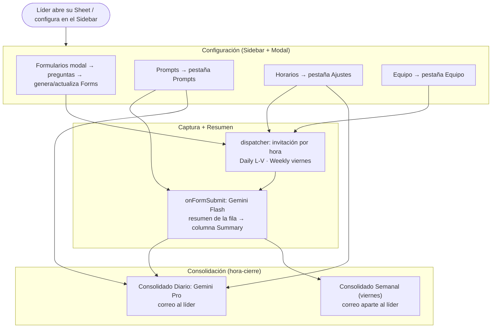

# CLEVEL-REPORTS

Workflow integrado que captura reportes **Daily** y **Weekly** del equipo de un líder C-level,
resume cada respuesta y envía consolidados ejecutivos al líder. Daily y Weekly son **dos flujos
dentro del mismo workflow** porque comparten Sheet, equipo, dispatcher, librería y sidebar.

## Business intent

- Cada día hábil, cada persona del equipo recibe una **invitación** a llenar su Daily; los viernes,
  además, su Weekly.
- Al enviar el Form, su respuesta se **resume** en la columna `Summary` de la fila (vía Gemini).
- A la **hora de cierre**, los `Summary` del día se **consolidan** en un correo ejecutivo al líder;
  los viernes se envía además un consolidado semanal en correo aparte.
- El líder **personaliza** prompts, horarios y equipo desde el **sidebar** (`CoS → Configurar`) y
  las preguntas de los Forms desde el **modal** (`CoS → Formularios`) — sin código.
- El líder es el **usuario C-level** que recibe los consolidados en su propio correo.

## Execution assumptions

- Durante una invocación de tarea, las pestañas de settings (`Prompts`, `Equipo`) se tratan como
  **inmutables**: la tarea las lee una vez a memoria y no espera ediciones a mitad de corrida.
- Todo corre **como el líder** (autorizó con su @xertica): correos y cuota a su nombre.
- Los encabezados de las preguntas **no son un contrato**: se personalizan. El resumen usa
  *pass-through genérico* (ver [Contrato de datos](#contrato-de-datos)).
- Un `Summary` creado **después** de la hora de cierre no entra en el consolidado de ese día.

## Status legend

- `Implemented` — el código existe hoy y su comportamiento es parte del contrato de runtime.
- `High-level` — solo el intent de negocio está definido; el spec detallado es TBD.

> **Este workflow está `Implemented`.** El runtime vive en la librería `CoSLib` (ver anclas en
> [../../architecture-and-contracts.md#anclas-de-implementación](../../architecture-and-contracts.md#anclas-de-implementación));
> cada líder tiene un stub delgado que apunta a una versión publicada.

## Workflow map



---

## Contrato de datos

El código lee **por nombre de encabezado** (fila 1), no por posición. Las pestañas de settings
tienen encabezados fijos; las de respuestas del Form tienen **encabezados variables** (los define
el líder al personalizar preguntas).

### Pestaña `Daily` / `Weekly` (respuestas del Form)

| Columna | Naturaleza | Uso |
|---|---|---|
| `Marca temporal` | fija (Google la crea) | filtro "de hoy" |
| `Dirección de correo electrónico` | fija (Google la crea) | correo **verificado** de la sesión del respondiente |
| *(columnas de preguntas)* | **variables** | **entrada del resumen (pass-through genérico)** |
| `Nombre` | fija (contrato) | nombre para el consolidado — **cruzado desde `Equipo`** |
| `Correo` | fija (contrato) | correo del respondiente — **copiado del verificado** |
| `Lider` | fija (contrato) | filtro de equipo del líder |
| `Summary` | fija (salida) | **resultado del resumen individual** (se crea sola si no existe) |

> **Identidad: el Form no la pregunta.** El formulario solo lleva las preguntas del líder — sin
> casilla `Nombre` ni `Correo`. Google recolecta el correo en modo **verificado** (lo toma de la
> cuenta con la que el respondiente inició sesión, sin mostrar ningún campo) y al recibir la
> respuesta `enriquecerFilaConRoster_` lo cruza contra la columna `Correo` de la pestaña
> [`Equipo`](#pestaña-equipo-roster-del-líder) para rellenar `Nombre` y `Correo`. Ambas columnas se
> crean solas si faltan. Si quien responde no está en `Equipo`, `Correo` igual queda registrado y
> `Nombre` se deja vacío (el resumen y el consolidado caen al correo).
>
> El modo verificado se aplica en dos pasos porque `FormApp` no lo expone: `setCollectEmail(true)`
> y luego un `batchUpdate` de la **Forms REST API** con `emailCollectionType: VERIFIED`. El segundo
> paso es best-effort: si la Forms API no está habilitada en el proyecto de Cloud, el Form sigue
> funcionando pero muestra la casilla `Correo` y se registra el motivo en el log — se corrige a mano
> en *Configuración → Recopilar direcciones de correo → Verificado*.

> **Pass-through genérico.** El resumen NO asume qué preguntas hay. Toma **todas** las columnas
> entre el bloque fijo inicial y las columnas de contrato final (`Nombre`, `Correo`, `Lider`,
> `Summary`) y las manda al LLM como pares `pregunta → respuesta`. El líder puede cambiar preguntas
> sin romper nada; la estructura de la salida la impone el system-prompt, no las columnas. Ver
> [sidebar-and-prompts.md](sidebar-and-prompts.md#pass-through-al-resumen).

### Correos (HTML)

Los tres correos (invitación Daily, invitación Weekly, consolidado) se arman en
`shared/email-runtime.js` — **único lugar del runtime que genera HTML**. El resto pasa
contenido en texto; nunca marcado.

| Regla | Por qué |
|---|---|
| Estilos **inline**, layout con `<table>`, máx. 600px | Gmail descarta `<style>` en varios clientes y no soporta flex/grid |
| Siempre se manda **texto plano + `htmlBody`** | Fallback para clientes sin HTML |
| Todo contenido dinámico pasa por `escapeHtml_` | La salida del LLM y los nombres del roster son datos no confiables |
| El wordmark va como **texto**, no imagen | Los clientes bloquean imágenes remotas por defecto |

> **Al LLM nunca se le pide HTML.** El prompt define *qué dice* (secciones); el código define
> *cómo se ve*. `parseSecciones_` hace un **parseo tolerante** del texto: reconoce encabezados en
> MAYÚSCULAS, `## markdown` y `**negritas**`, y viñetas con `-`, `*`, `•` o numeradas. Si no
> reconoce ninguna sección (el modelo devolvió texto corrido), degrada a una tarjeta única en vez
> de romperse. El color del filete de cada tarjeta sale de una tabla de palabras clave
> (LOGRO→verde, BLOQUEO→naranja, RIESGO→rojo…), así el líder puede renombrar sus secciones en el
> prompt sin romper nada.

Paleta tomada de las variables CSS de `xertica.ai`: `ink #1a1814`, `surface #fffef8`,
`cream #f2edd8`, `amarillo #faf338` (solo como fondo — sobre blanco no contrasta), más los
acentos `celeste / verde / naranja / rojo / magenta / morado`.

### Pestaña `Equipo` (roster del líder)

| Columna | Uso |
|---|---|
| `Nombre` | saludo de la invitación |
| `Correo` | destinatario de la invitación |
| `Rol` | contexto (opcional, puede enriquecer `user.md`) |

> El **líder** (destinatario de los consolidados) y sus **horarios** viven en la config del
> workflow / pestaña de settings, no en cada fila de `Equipo` — a diferencia de la v0.5, aquí el
> Sheet es de un solo líder. Ver [Config](#config).

### Pestaña `Prompts`

Clave→valor, una fila por artefacto editable. Detalle y defaults en
[sidebar-and-prompts.md](sidebar-and-prompts.md#storage-de-prompts).

| `key` | `value` |
|---|---|
| `soul` | voz/persona del asistente |
| `user` | contexto del líder y su equipo |
| `task.summary.daily` | system-prompt del resumen Daily por fila |
| `task.summary.weekly` | system-prompt del resumen Weekly por fila |
| `task.consolidated.daily` | system-prompt del consolidado Diario |
| `task.consolidated.weekly` | system-prompt del consolidado Semanal |

### Pestaña `Ajustes`

Clave→valor con lo editable en runtime (lo escriben el sidebar y el modal; se crea sola). Defaults en
`shared/settings-runtime.js`.

| `key` | Uso |
|---|---|
| `leader.email`, `leader.name` | líder C-level que recibe los consolidados |
| `schedule.invitesDaily`, `schedule.invitesWeekly` | horas `HH:mm` de las invitaciones |
| `schedule.closeDaily`, `schedule.closeWeekly` | horas `HH:mm` de cierre/consolidado (Daily L–V, Weekly viernes) — **separadas** |
| `timezone` | zona horaria del líder (IANA, p.ej. `America/Bogota`) — el dispatcher interpreta todas las horas en esta zona |
| `forms.dailyUrl`, `forms.weeklyUrl`, `forms.dailyFormId`, `forms.weeklyFormId` | Forms generados desde el modal |
| `questions.daily`, `questions.weekly` | preguntas del líder (JSON) — permiten repintar el modal |
| `form.title.daily`, `form.title.weekly` | título del Form (si vacío, se mantiene el actual) |
| `form.desc.daily`, `form.desc.weekly` | descripción del Form |
| `prompt.gen.daily`, `prompt.gen.weekly` | prompt de generación por IA (se persiste para recargarlo en el modal) |

> `getAjustes_` expone `form.title.*`/`form.desc.*`/`prompt.gen.*` agrupados como
> `formMeta:{ daily:{titulo,descripcion,prompt}, weekly:{…} }`, que `cargarConfig` devuelve para
> precargar el modal.

---

## Config

El CONFIG se parte en dos: lo **estático** (código, en `config.js`) y lo **editable en runtime**
(pestaña `Ajustes`). El stub los mezcla con `CoSLib.construirConfig(sheetId, CONFIG_STATIC)`.

**Estático** — `workflows/CLEVEL-REPORTS/config.js` (`Implemented`):

```javascript
var CONFIG_STATIC = {
  sheets: { daily: 'Daily', weekly: 'Weekly', roster: 'Equipo', prompts: 'Prompts', settings: 'Ajustes' },
  models: { perRow: 'gemini-3.6-flash', consolidated: 'gemini-3.1-pro-preview' },
  timezone: 'America/Lima',
  dispatchWindowMin: 5,
  options: { regenerateSummaryIfPresent: false, weeklyOnlyFriday: true, sendEmptyConsolidated: true }
};
```

**Editable** (pestaña `Ajustes`, escrito desde el sidebar y el modal) → `construirConfig` lo agrega
como `leader:{email,name}`, `schedule:{invitesDaily,invitesWeekly,closeDaily,closeWeekly}`,
`timezone` (editable por líder; fallback al `timezone` estático) y `forms:{dailyUrl,weeklyUrl}`.

Ningún código referencia IDs, nombres de hoja o patrones directamente — todo pasa por el CONFIG
mezclado. Los IDs de modelo se mantienen en sync con `cos.config.json → gemini`.

---

## Options

Opciones de comportamiento del workflow (pensadas para vivir en una fila de settings o en `CONFIG`):

| Opción | Tipo | Default | Efecto |
|---|---|---|---|
| `regenerateSummaryIfPresent` | boolean | `false` | Si `true`, `onFormSubmit` regenera el `Summary` aunque la fila ya tenga uno. |
| `weeklyOnlyFriday` | boolean | `true` | Restringe invitación y consolidado Weekly a viernes. |
| `sendEmptyConsolidated` | boolean | `true` | Si no hubo `Summary` hoy, envía igual un correo indicándolo (vs. no enviar nada). |

---

## Flujos

### 1. Resumen por fila — `onFormSubmit` · `Implemented`

1. Trigger instalable `onFormSubmit` a nivel del Sheet (cubre Daily y Weekly; detecta la hoja).
2. Lee la fila enviada; arma los pares pregunta→respuesta (pass-through genérico).
3. Compone el prompt: `soul` + `user` + `task.summary.<daily|weekly>` + datos.
4. Llama a Gemini **Flash**; escribe el resultado en `Summary`. Idempotente (ver playbook).

### 2. Invitaciones — `dispatcher` cada 5 min · `Implemented`

1. Compara la hora actual (zona `CONFIG.timezone`) contra `schedule.invitesDaily` /
   `schedule.invitesWeekly` dentro de una ventana de `dispatchWindowMin`.
2. Daily de **lunes a viernes**; Weekly **solo viernes**.
3. Envía a cada `Correo` de la pestaña `Equipo`, **nombrando al líder**; guarda anti-dup por
   persona/tipo/día.

### 3. Consolidados — `dispatcher` a `schedule.closeDaily` / `closeWeekly` · `Implemented`

1. **Consolidado Diario** a `schedule.closeDaily` (L–V): junta los `Summary` de hoy, compone
   `soul` + `user` + `task.consolidated.daily` + lista, llama a Gemini **Pro** y envía al líder.
2. **Consolidado Semanal** a `schedule.closeWeekly` (solo viernes): igual con `task.consolidated.weekly`,
   en un correo **aparte**.
3. Ambas horas son **independientes** y se interpretan en la `timezone` del líder. Guarda anti-dup
   por tipo/día.

---

## Triggers

> `Implemented` — `workflows/CLEVEL-REPORTS/triggers.js`. Se instalan desde el **stub** (bound).

| Trigger | Función | Cadencia | Acción |
|---|---|---|---|
| `onFormSubmit` (instalable, Sheet) | `onFormSubmit` | al enviar cualquier Form | Genera el `Summary` de la fila (Flash) |
| Time-driven | `dispatcher` | cada 5 min | Invitaciones (por hora) + consolidados (a `close`) |

`setupTriggers()` corre una vez a mano en el stub (pide autorizar permisos) e instala ambos.
Cambiar horarios en el panel **Horarios** **no** toca triggers: el `dispatcher` lee las horas en
vivo de `Ajustes` en cada corrida.

---

## UI centralizada (bootloader)

El **stub** de cada líder es un *bootloader* delgado: la UI (menú, sidebar, modal, diálogos) y la
lógica viven en la **librería**, así que las mejoras llegan por **versión** sin re-copiar el Sheet.

- **Menú:** `onOpen` (trigger simple del stub) delega en `CoSLib.construirMenu(ui)`. Dos ítems:
  **Configurar** (→ `abrirSidebar`) y **Formularios** (→ el slot `cosMenu1`, que abre el modal). Los
  ítems apuntan a funciones del stub **por nombre** (`abrirSidebar` y slots `cosMenu1..5`), porque
  los handlers de menú resuelven en el stub, no en la librería.
- **Sidebar / modal / diálogos:** `abrirSidebar` muestra `CoSLib.buildSidebar()`; los HTML viven en
  `shared/Sidebar.html` y `shared/DialogPreguntas.html` (`createHtmlOutputFromFile` carga del
  proyecto que ejecuta = la librería). El modal se registra en `DIALOGOS_.preguntas` y se abre desde
  el slot `cosMenu1` (`MENU_ACTIONS_.cosMenu1` → `showModalDialog`); diálogos nuevos siguen el mismo
  patrón, o el opener genérico `abrirDialogo(nombre)` del stub.
- **Server-API (sidebar y modal):** `google.script.run` resuelve siempre en el stub. El puente
  genérico `cosRun(fnName, argsJson)` → `CoSLib.dispatch(...)` deja registrar funciones nuevas en la
  librería sin nuevo wrapper — es el canal del modal (`generarPreguntasIA`, `guardarFormulario`).
  Los 6 wrappers nombrados actuales se conservan por compatibilidad (los usa el sidebar).

> **Distribución:** las actualizaciones se despliegan re-empujando la librería (admin) y publicando
> una versión nueva; los stubs apuntan a esa versión. **No** hay auto-actualización desde el menú:
> el botón *"Actualizar CoS"* y `shared/update-runtime.js` (con el scope `script.projects`) se
> **retiraron en la v8**. Ver [distribucion-de-actualizaciones.md](../../distribucion-de-actualizaciones.md).

**Qué queda congelado en el stub** (superficie estable, se re-empuja solo si cambia): `onOpen`,
`abrirSidebar`, `abrirDialogo`, `cosRun`, slots `cosMenu1..5`, handlers de activadores
(`onFormSubmit`, `dispatcher`) y los helpers de prueba del editor.

---

## Límites conocidos (heredados del modelo v0.5)

1. **Ventana de horas = 5 min:** un correo sale en `[hora, hora+5min)`; para precisión al minuto,
   baja el intervalo del trigger y `dispatchWindowMin`.
2. **Reportes tardíos:** un `Summary` posterior a la hora de cierre no entra en ese consolidado.
3. **Sin reintentos de trigger:** una corrida fallida se recupera en la siguiente ventana.
4. **Cuotas:** `MailApp` (100/día gratis; 1500 Workspace) y runtime diario de Apps Script — de
   sobra para un equipo chico, pero tenerlo presente al escalar.

## Compartir reportes (Fase 1: correos)

Para el caso "un colaborador reporta a dos jefes" sin llenar dos formularios. Dos granularidades,
configuradas desde el modal **CoS → Compartir reportes** (`shared/DialogCompartir.html`, matriz
consolidado + por persona) o a mano en la hoja:

- **Por persona** — columna `Compartir con` en `Equipo` (correos por coma): al cierre
  (`closeDaily`/`closeWeekly`), cada destinatario recibe SOLO el Summary del día de esa persona;
  si no reportó, el aviso de silencio ("X no envió su reporte hoy"). Anti-dup por persona+tipo+fecha.
- **Consolidado completo** — clave `consolidado.cc` en Ajustes: esos correos van en CC del mismo
  correo de consolidado del líder (todo el equipo).
- **Dedup**: quien recibe el consolidado completo no recibe además los individuales.
- **Transparencia activa**: la invitación de una persona compartida le dice a quién más llega su
  reporte, y el correo compartido dice quién lo comparte (patrón del aviso del brain en el Form).
- `guardarEquipo` **preserva** la columna `Compartir con` al reescribir el roster (re-asocia por
  correo; si el correo de una persona cambia, su compartir se pierde).
- Diseño y maquetas: [`../../html/compartir-reportes-mockups.html`](../../html/compartir-reportes-mockups.html)
  (la Fase 2 — conexión CoS-a-CoS — quedó bocetada ahí, fuera de scope por ahora).

## Relación con la v0.5

Este workflow reencarna el pipeline de la v0.5
([`../../../../Chief-of-Staff-Agent/md/COS-AppScript-v0.5-OpenAI-Guide.md`](../../../../Chief-of-Staff-Agent/md/COS-AppScript-v0.5-OpenAI-Guide.md))
con tres cambios de fondo: **per-líder** (Sheet propio en vez de central), **Gemini** en vez de
OpenAI, y **prompts + preguntas editables** desde el sidebar y el modal (con generación por IA) en
vez de hardcodeados.
