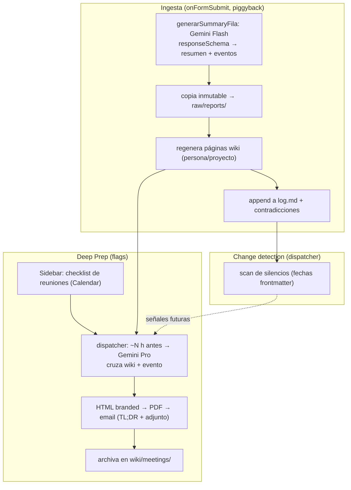

# SECOND-BRAIN

Workflow que evoluciona CoS-Agent de "resumir reportes" a **memoria organizacional que se
autoconstruye**: cada Daily/Weekly alimenta un *second brain* en Drive (patrón LLM-Wiki de
Karpathy), y sobre esa memoria se genera un **Deep Prep** en PDF por correo para una reunión
próxima. Extiende [CLEVEL-REPORTS](../CLEVEL-REPORTS/CLEVEL-REPORTS.md); reusa su Sheet, equipo,
dispatcher, librería y sidebar.

## Business intent

- Cada respuesta que ya se resume (`onFormSubmit`) además **ingesta** al brain: sin costo extra de
  API, extendiendo el mismo call de Gemini para devolver resumen + eventos estructurados.
- El brain vive en una **carpeta propia de Drive** que la app autocrea (`CoS-Brain/`), legible y
  auditable por el líder, con el diseño de wiki de **Andrej Karpathy** (capas raw/wiki, páginas por
  entidad, frontmatter YAML, log append-only). El C-level **lee, nunca edita** el wiki.
- El sistema detecta **contradicciones** (LLM en la ingesta) y **silencios** (scan determinista de
  fechas en el dispatcher) — el valor CoS real, no un chatbot Q&A.
- Con dos feature flags, el líder tilda una reunión del calendario y **~N horas antes** recibe un
  **Deep Prep** en PDF branded (estilo Vera) + TL;DR en el cuerpo, cruzando el brain con los
  detalles del evento.
- Todo **opt-in y con gobernanza**: retención configurable del raw, "olvidar a X", aviso de
  transparencia en el Form.

## Execution assumptions

- Corre **como el líder** (mismos permisos y cuota que CLEVEL-REPORTS). Los scopes nuevos
  (`calendar.readonly`, `drive`) son auto-consentibles por el propio líder (sin verificación de
  app para uso interno).
- El brain es **self-contained** en `CoS-Brain/` por diseño (la app solo toca esa carpeta), aunque
  el scope es `drive` completo: **lección aprendida** — `DriveApp` exige `auth/drive` cuando el
  manifest declara scopes explícitos; `drive.file` solo lo respeta la Drive API avanzada (posible
  refactor futuro si se quiere volver al scope angosto).
- Los C-levels **no integran Obsidian**; el diseño Karpathy se mantiene igual (Obsidian sería un
  mirror opcional futuro, fuera de scope).
- La ingesta piggyback asume que `generarSummaryFila` es el único punto por-fila; el brain no
  agrega llamadas Gemini nuevas en el camino caliente.
- El Deep Prep se ejecuta desde el **dispatcher de 5 min** ya existente (no un trigger nuevo).

## Status legend

- `Implemented` — el código existe hoy y su comportamiento es parte del contrato de runtime.
- `Planned` — diseño confirmado con el líder; aún sin código.

> **Estado:** `Implemented` — las Fases 0–5 están completas y con tests (`npm test`). Falta solo el
> paso de deploy manual (congelar la versión nueva de `CoSLib` con `clasp create-version` y apuntar
> la plantilla del stub), ver [testing-and-deploy.md](../../testing-and-deploy.md).
>
> El diseño fue confirmado en una sesión de grill + entrevista (ago 2026). Las decisiones vivas
> están registradas en la memoria `second-brain-research`. Las anclas de archivo/test viven en
> [architecture-and-contracts.md](../../architecture-and-contracts.md#anclas-de-implementación).

## El brain (patrón LLM-Wiki de Karpathy)

Tres capas dentro de `CoS-Brain/` en Drive:

| Capa | Contenido | Quién escribe | Estrategia |
|---|---|---|---|
| `raw/reports/` | Copia **inmutable** de cada reporte ingerido | App (append) | Nunca se pisa; verdad de origen |
| `wiki/` | `index.md`, `log.md`, `people/`, `projects/`, `meetings/` | LLM (regenera) | Recompilable desde `raw/` |
| `_schema.md` | Config del schema de páginas y frontmatter | Humano/App | Estable |

Analogía de "compilación": `raw/` = fuente, `wiki/` = binario. Se regenera, no se edita a mano.

- **Páginas de entidad** con frontmatter YAML: `page_type`, `name`, `last_updated`, `confidence`,
  `tags`, `sources`, `open_blockers` + una *summary line*.
- `log.md` **append-only** con timestamp: rastro de cada ingesta y cada contradicción/silencio.
- Entidades: **Persona** (match por email vs roster), **Proyecto** (LLM extrae + match difuso +
  `_projects.json` de alias + autocrea + merge desde el sidebar), **Reunión** (prep → acta).
- Sin `_state.json` ni bloques marcados: el estado vive en el frontmatter; como el humano no edita,
  no hay riesgo de clobber.

## Workflow map



## Plan por fases

Orden de dependencia: **brain primero** (que se pueble), **Deep Prep después**. Los flags codifican
esta secuencia (`deepPrep.enabled` requiere `brain.enabled`).

### Fase 0 — Cimientos (scopes, config, carpeta Drive) ✅ Implemented
Que existan permisos, claves de config y la carpeta del brain.
- `appsscript.json` (stub + `shared/`): agregar `calendar.readonly` y `drive` (ver la nota de la
  tabla de scopes: `drive.file` no le alcanza a `DriveApp`). Los scopes de librería **no** se
  heredan al contenedor → declararlos explícitos en el manifest del stub.
- `settings-runtime.js` → `AJUSTES_DEFAULTS_`: `brain.enabled='false'`, `brain.folderId=''`,
  `brain.retentionMonths='12'`, `deepPrep.enabled='false'`, `deepPrep.leadHours='3'`,
  `deepPrep.selected='[]'`. `construirConfig` las levanta.
- **Nuevo** `shared/brain-drive-runtime.js`: `ensureBrainFolder_(config)` autocrea la estructura y
  persiste `brain.folderId`; helpers de I/O + (de)serialización markdown+frontmatter.
- Tests: `tests/brain-drive-runtime.test.mjs`. Deploy: re-correr `setupTriggers()` (re-consentimiento).

### Fase 1 — Ingesta (memoria que se autoconstruye) ✅ Implemented
- **Nuevo** `shared/brain-ingest-runtime.js`: `responseSchema` extendido (resumen + eventos);
  `resolverProyecto_` (match difuso + alias + autocreate); `regenerarPagina_`; `appendLog_`;
  contradicciones vía el mismo LLM.
- Cambio `summaries-runtime.js` → `generarSummaryFila`: tras el resumen, si `brain.enabled`, ingesta
  con el mismo resultado y copia a `raw/reports/`.
- Tests: `tests/brain-ingest-runtime.test.mjs`.

### Fase 2 — Change detection (silencios) ✅ Implemented
- Cambio `dispatcher-runtime.js`: `scanSilencios_` recorre frontmatter (`last_updated`,
  `open_blockers`), marca lo estancado, registra en `log.md`. Behind `brain.enabled`. Deja señales
  listas para el futuro `notificar()`.
- Tests: `tests/brain-silences-runtime.test.mjs`.

### Fase 3 — Deep Prep (selección + generación + PDF email) ✅ Implemented
- **Nuevo** `shared/deepprep-runtime.js`: `generarDeepPrep_(eventId)` junta páginas wiki de
  asistentes+proyectos + detalles del evento → **Pro** (`gemini-3.1-pro-preview`) → HTML reusando
  `email-runtime.js` → PDF (`Utilities.newBlob(html,'text/html').getAs('application/pdf')`) → email
  (TL;DR en cuerpo + PDF adjunto) → archiva en `wiki/meetings/`.
- Cambio `dispatcher-runtime.js`: pasada deep-prep — por cada `eventId` de `deepPrep.selected` dentro
  de `leadHours`, genera con anti-dup por `eventId`. Behind `deepPrep.enabled`.
- Sidebar (server, en `CoSLib.dispatch`): `listarReunionesProximas`, `toggleReunionPrep`.
- Tests: `tests/deepprep-runtime.test.mjs`.

### Fase 4 — Sidebar: visor de wiki + merge + flags + gobernanza ✅ Implemented
- `Sidebar.html`: panel **Prep** (checklist), panel **Brain** (lista páginas + render markdown
  liviano), **merge** de proyectos, **toggles** (`brain.enabled`, `deepPrep.enabled`, `leadHours`,
  retención).
- Server en `CoSLib.dispatch`: `listarWikiPaginas`, `leerWikiPagina`, `mergearProyectos`,
  `guardarFlags`, `olvidarPersona` (borra página + raw).
- Gobernanza: `purgarRaw_` por `retentionMonths` en el dispatcher; aviso de transparencia en la
  descripción del Form.
- Tests: `tests/brain-admin-runtime.test.mjs` (visor/merge/flags/olvidar/purga + ruteo `dispatch`).

### Fase 5 — QA + deploy ✅ Implemented (código) · deploy manual pendiente
- Helpers manuales en el stub: `testBrainIngest()`, `testDeepPrep()` (patrón `testResumen*`). El
  segundo llama al wrapper público `CoSLib.probarDeepPrep` (genera YA, sin ventana lead ni anti-dup).
- Actualizada la tabla de anclas en
  [../../architecture-and-contracts.md](../../architecture-and-contracts.md#anclas-de-implementación).
- **Pendiente (manual, gated):** `clasp create-version` para congelar la versión nueva de `CoSLib`
  y luego apuntar `workflows/CLEVEL-REPORTS/appsscript.json` a esa versión. El stub ya declara los
  scopes nuevos (`calendar.readonly`, `drive`); re-correr `setupTriggers()` fuerza el
  re-consentimiento en cada copia. Ver [testing-and-deploy.md](../../testing-and-deploy.md).

### Fase 6 — Backfill del histórico ✅ Implemented
Importa al brain las respuestas YA guardadas en Daily/Weekly (previas a activar la memoria), para
arrancar con contexto sin esperar reportes nuevos. Diseño acordado en grill (ago 2026):
- **Nuevo** `shared/brain-backfill-runtime.js`: job **reanudable por cursor** (uno por hoja,
  persistidos en Ajustes `brain.backfill.*`); lo avanza `runDispatcher` **al final** de cada pasada,
  time-boxed (~3.5 min, tope 30 filas), para no retrasar invitaciones/consolidados.
- **Merge cronológico** Daily+Weekly por Marca temporal: el estado previo de cada página (y las
  contradicciones) evoluciona en el orden real. Cada fila se ingesta con **la fecha de la fila**
  (no la de hoy): wiki, purga y scan de silencios reflejan cuándo pasó.
- Selección: dentro de `brain.retentionMonths`, correo en el roster actual, con contenido; lo demás
  se salta y se cuenta. Fila que falla en Gemini: avanza, cuenta el error, queda en `log.md`.
- Summary de la fila: se rellena **solo si estaba vacío**. Idempotente: el raw `_r<fila>` existente
  no se re-escribe y los eventos dedup-ean por línea.
- Scan de silencios **suspendido** mientras `running` (falsos estancados con la wiki a medio
  construir); al terminar corre normal — el burst inicial de silencios reales es señal, no ruido.
- Sidebar (panel Brain → "Importar histórico"): confirm con conteo real (elegibles + saltadas con
  desglose), progreso `ok/total`, Pausar/reanudar. Server: `iniciarBackfill`, `estadoBackfill`,
  `cancelarBackfill` (via `dispatch`; iniciar exige `brain.enabled`).
- Tests: `tests/brain-backfill-runtime.test.mjs` (18 tests: la matriz completa del grill).

## Contrato de datos (ingesta)

El `responseSchema` del call por-fila devuelve, además del resumen:

```
eventos: [ { persona:string(email|nombre), proyecto:string, tipo:enum(avance|blocker|riesgo|decision|silencio), texto:string, confidence:number } ]
```

- `persona` se resuelve contra el roster (email exacto → nombre).
- `proyecto` se normaliza y matchea difuso contra `_projects.json`; sin match → autocrea + entrada de alias.
- Las **contradicciones** las marca el LLM comparando el evento nuevo contra el estado previo de la página.

## Scopes nuevos

| Scope | Para qué | Gated por admin |
|---|---|---|
| `calendar.readonly` | Leer reuniones próximas (checklist + detalles del Deep Prep) | No |
| `drive` | Crear/leer la carpeta `CoS-Brain/` vía `DriveApp` | No (sensible, pero auto-consentible) |

> Originalmente se eligió `drive.file` (no sensible), pero `DriveApp.createFolder` y compañía
> **exigen el scope completo** cuando el manifest declara scopes explícitos — el error en runtime
> es "Los permisos especificados no son suficientes…". `drive.file` solo funciona con la Drive API
> avanzada (`Drive.Files.*`), que sería el refactor si se quiere recuperar el scope angosto.

## Diferido (fuera de scope)

- Ingesta de Gemini Notes/Meet (`drive.meet.readonly`, gated por admin + consentimiento).
- Canal Chat/Telegram (`notificar()`); las señales de change-detection ya quedan listas para engancharlo.
- Grounding web para externos, mirror "lindo" en Doc, búsqueda estilo QMD, mirror Obsidian.

## Anclas de implementación

Las anclas de archivo/test de este workflow (todas `Implemented`) viven en la tabla canónica de
[architecture-and-contracts.md](../../architecture-and-contracts.md#anclas-de-implementación):
`shared/brain-drive-runtime.js`, `shared/brain-ingest-runtime.js`, `shared/brain-admin-runtime.js`,
`shared/deepprep-runtime.js`, el scan de silencios + purga + pasada de Deep Prep en
`shared/dispatcher-runtime.js`, y sus tests (`tests/brain-*.test.mjs`, `tests/deepprep-runtime.test.mjs`).
